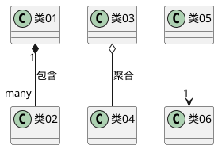

# VitePress


## 简介

`vitepress` 是一个静态站点生成器，英文名为 `SSG` (Static Site Generation) 。与它类似的还有 [vuepress](https://vuepress.vuejs.org/) 、[hexo](https://hexo.io/index.html)，`python` 语言也有 [shpinx](https://www.sphinx-doc.org/en/master/)、[mkdocs](https://www.mkdocs.org/) 之类的工具，`react` 也有 [docusaurus](https://docusaurus.io/)。

但是在这么多的工具里面，`vitepress` 是上手成本最低的，也是配置最简单的（需要会 JavaScript ），界面也很漂亮，有适配移动端。只要写 `markdown` 文件与 `javascript` 配置文件，就可以快速搭建器一个网站。

`vitepress` 考虑到用户可能会需要定制化，所以提供了很多的接口与插槽，如果会用 `vue` 开发项目，就可以自己改。并且可以使用`tailwind css`、 `elements-plus` 等框架，使用起来非常方便。


## 项目结构

```shell
.
├───docs  # 文档目录 主要的文档、项目的配置文件都在这里
│   ├───.vitepress  # vitepress配置文件目录
│   │   ├───cache # 本地运行项目的缓存目录
│   │   ├───config  # vitepress配置文件
│   │   │   ├───index.mts # vitepress配置文件
│   │   │   ├───markdown.mts  # markdown配置文件
│   │   │   ├───nav.mts # 导航配置文件
│   │   │   ├───sidebar.mts # 侧边栏配置文件
│   │   │   └───util.mts # 工具函数文件
│   │   ├───theme # 自定义主题目录
│   │   │   ├───components # 自定义组件目录
│   │   │   └───css # 自定义样式目录
│   │   └───config.mts # vitepress配置文件
│   ├───nav # 导航文件目录
│   ├───posts # 博客文章目录
│   ├───public # 静态资源目录
│   │   └───images # 图片目录，在项目中可以使用 /images/文件名 进行引用
│   └───vitepress # vitepress文档目录
├───script # 自定义脚本目录
├───.gitignore # git忽略文件
├───Jenkinsfile # jenkins配置文件
├───package.json # 项目配置文件
└───package-lock.json # 项目配置文件
```

现在的这篇文章在项目中的位置是 `docs/vitePress/index.md`，在本项目中，所有的文档都放在 `docs` 目录中。你可以根据自己的需求创建与之对应的目录，比如 `docs/about` 目录下存放关于项目的文档，然后在主页或者导航栏中添加对应的链接。

## 项目功能

本项目是基于 `vitepress` 搭建并在其基础上添加了一些自定义组件和样式以满足自己的需求，下面简单介绍一下。


### 返回顶部

在文章页面、博客的标签页面等页面中，添加了返回顶部的按钮。主要还是为了移动端的体验，虽然官方对于移动端有提供返回顶部的按钮，但是体验不是很好需要多点击一次。


### 代码块支持PlantUML

PlantUML是一个通用性很强的工具，可以快速、直接地创建各种图表。
利用简单直观的语言，用户可以毫不费力地绘制各种类型的图表。 如需详细了解该语言的功能和语法，请参阅《[PlantUML 语言参考指南](https://plantuml.com/zh/guide)》。
如果您是 PlantUML 的新用户，我们建议您从我们的[快速入门页面](https://plantuml.com/zh/starting)开始 并快速运行。如果您有任何问题，我们的[常见问题页面](https://plantuml.com/zh/faq)是一个很有价值的资源。 此外，PlantUML 可以与其他各种工具无缝集成，以增强您的工作流程。

::: tip
上面一段内容是的PlantUML官方介绍，更详细的内容请参考 [PlantUML](https://plantuml.com/zh/) 官方文档。
:::

<b>示例</b>

在markdown文章中，使用如下代码块即可

````markdown

````

网页端渲染效果为


### 图片点击缩放

vitepress官方是不支持图片点击缩放的，所以需要自己写一个组件来实现这个功能。

可以使用

<b>示例</b>


### iframe播放控件

使用iframe组件来添加B站播放链接，只需在文档中添加如下代码即可

```markdown
<Iframe link="//player.bilibili.com/player.html?isOutside=true&aid=113333550321671&bvid=BV1GeCoYFEuQ&cid=26363233569&p=1&autoplay=0" />
```

效果如下

[//]: # (在link链接尾部添加 &autoplay=0 可以解决自动播放的问题)
<Iframe link="//player.bilibili.com/player.html?isOutside=true&aid=113333550321671&bvid=BV1GeCoYFEuQ&cid=26363233569&p=1&autoplay=0" />


### 链接卡片

链接卡片可以为文章中的链接添加卡片样式，方便用户点击跳转（主要是样式支持😊）。

```markdown
<Linkcard url="https://vitepress.yiov.top/" title="Vitepress中文搭建教程" description="https://vitepress.yiov.top/" logo="https://vitepress.yiov.top/logo.png"/>
```

效果如下

<Linkcard url="https://vitepress.yiov.top/" title="Vitepress中文搭建教程" description="https://vitepress.yiov.top/" logo="https://vitepress.yiov.top/logo.png"/>


### 视频播放控件

视频播放控件，需要提供视频文件直链或者本地视频链接，只需在文档中添加如下代码即可

```markdown
<xgplayer url="//sf1-cdn-tos.huoshanstatic.com/obj/media-fe/xgplayer_doc_video/mp4/xgplayer-demo-360p.mp4" poster="//lf-cdn-tos.bytescm.com/obj/static/media_fe/xgplayer_doc3/assets/img/logo_10.cad7a477.png" />
```

效果如下

<xgplayer url="//sf1-cdn-tos.huoshanstatic.com/obj/media-fe/xgplayer_doc_video/mp4/xgplayer-demo-360p.mp4" poster="//lf-cdn-tos.bytescm.com/obj/static/media_fe/xgplayer_doc3/assets/img/logo_10.cad7a477.png" />


### 视频列表播放控件

视频列表播放控件是对视频播放控件的封装，方便在一个文档当中插入多个视频。只需在文档中添加如下代码即可

```markdown
<script setup>
const playlist = [
  {url: "//sf1-cdn-tos.huoshanstatic.com/obj/media-fe/xgplayer_doc_video/mp4/xgplayer-demo-360p.mp4", title: "1 xggplayer demo"},
  {url: "https://files.vidstack.io/sprite-fight/720p.mp4", title: "2 VidStack demo"},
];
</script>
<PlayList :dataList="playlist"/>
```

效果如下

<script setup>
const playlist = [
  {url: "//sf1-cdn-tos.huoshanstatic.com/obj/media-fe/xgplayer_doc_video/mp4/xgplayer-demo-360p.mp4", title: "1 xggplayer demo"},
  {url: "https://files.vidstack.io/sprite-fight/720p.mp4", title: "2 VidStack demo"},
];
</script>
<PlayList :dataList="playlist"/>


### 马克笔/荧光笔

这个功能主要是为了方便在文档中划重点，只需在文档中使用以下格式即可

```markdown
<sapn class="marker-text">这里是重重点</sapn>
<br />
<sapn class="marker-text-highlight">这里是荧光笔</sapn>
<br />
<sapn class="marker-evy">这里是尤雨溪的主页样式，鼠标放在我上面看效果</sapn>
```

为了方便展示效果我在三种样式间添加了换行符，实际使用时不需要。效果如下

<sapn class="marker-text">这里是重重点</sapn>
<br />
<sapn class="marker-text-highlight">这里是荧光笔</sapn>
<br />
<sapn class="marker-evy">这里是尤雨溪的主页样式，鼠标放在我上面看效果</sapn>


## 特别鸣谢

本人并不是前端开发人员，所以对前端技术也不是很了解，只是了解了一下 `vitepress`，然后根据其他大神的项目结合自己的需求构建了本项目，下面是一些参考手册。

- [vitepress 官方文档](https://vitepress.dev/zh/)
- [VitePress中文教程](https://vitepress.yiov.top/)
- [vitepress-theme-curve](https://github.com/imsyy/vitepress-theme-curve)
- [茂茂物语](https://notes.fe-mm.com/)
- [前端加油站](https://blog.jimmyxuexue.top/)
- [Justin3go](https://justin3go.com/)
- [正心博客](https://notes.zhengxinonly.com/posts/VitePress/02.VitePress%E5%BF%AB%E6%89%8B%E4%B8%8A%E6%89%8B.html)
- [李钟意讲前端](https://docs.ffffee.com/vitepress/vitepress-start.html)
- [查尔斯的知识库](https://blog.charles7c.top/tags)

::: tip
以上列表排名不分先后，本站的很多组件、文档都是从这些参考项目中提取出来的。以上链接中大多提供的都是已经构建、部署完成并公开的站点链接，在它们各自的站点中基本都有提供相应的开源项目链接，非常感谢这些大神的开源贡献！这些优秀的开源项目在我构建本项目的过程中起到了非常关键的作用，如果你也想通过vitepress构建站点可以去参考一下。
:::
